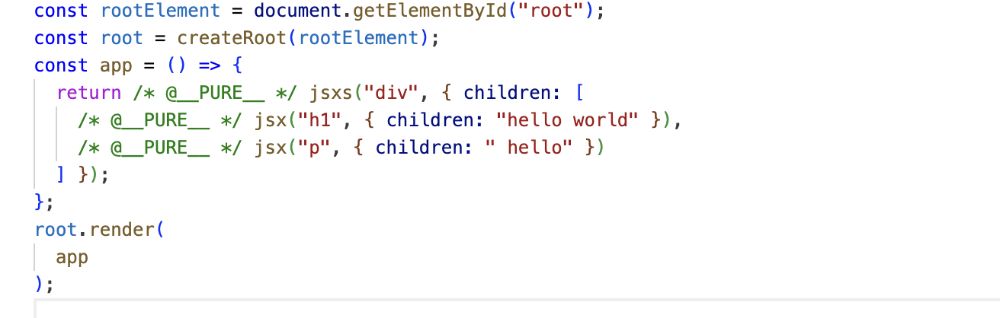

In previouse chapter we have learned how to use babel to transform JSX to Plain Javascript

in this chapter we will write the actual implementation transoformer function jsx()

```javascript

The component 
```javascript
const ui = <div id="root">Hello world</div>
```

is equivalent to
```javascript

const ui = React.jsx('div', {id: 'root', children: 'Hello world'})
```
 
if we have more than one child we can use an array
```javascript
const ui = <div id="root">
    <h1>Hello world</h1>
    <p>lorem ipsum</p>
</div>
```
is equivalent to
```javascript
const ui = React.jsx('div', {id: 'root', children: [
    React.jsx('h1', {children: 'Hello world'}),
    React.jsx('p', {children: 'lorem ipsum'})
]})
```


here each child is an object with type and props, the type is the tag name and props is an object with all the attributes and children

so we can write our jsx function in the jsx run time like this
```javascript
function jsx(type, props) {
    return {
        type,
        props
    }
}
```

if you run `npm run build` now 
in the build file we can see that we are using jsx function to transform jsx to plain javascript



you have to also export the jsxs function inorder to support multiple children the jsx run time

final version of jsx run time will look like this
```javascript
export const jsx = (tag, props) => {
   return { tag, props };
  };

export const jsxs = jsx;


