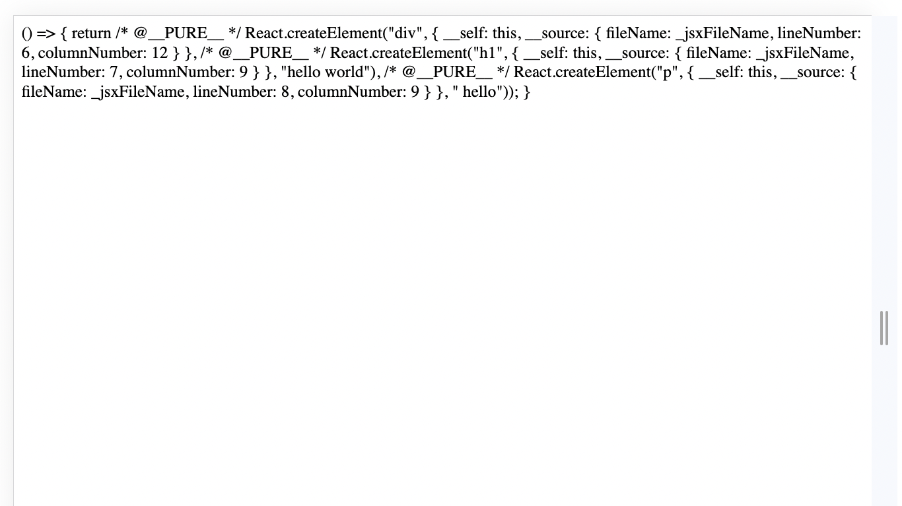
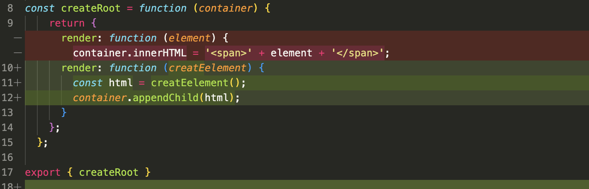
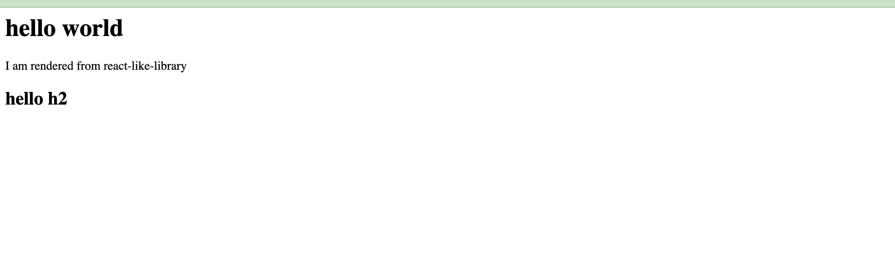

# Fixing JSX-DEV-RUNTIME and 1st version of render function


if you start our example project now it will give you error 
```bash 
     [vite] Internal server error: Failed to resolve import "../jsx-run-time/jsx-dev-runtime" from "index.jsx". Does the file exist?
```
this is because we have not specified jsx-dev-runtime (https://esbuild.github.io/api/#jsx-dev) as our jsxRuntime in @vitejs/plugin-react is set to be automatic by default . 

Either we have to specify jsxRuntime as classic or we have to create our own jsx-dev-run time in the folder jsx-run-time and import jsxDEV from react/jsx-dev-runtime 

For making the tutorial simple we will use the second approach and create our own jsx-dev-runtime in the folder jsx-run-time and import jsxDEV from react/jsx-dev-runtime 

for now , we will use same code for both jsx-runtime and jsx-dev-runtime 


```javascript
const createElement = function (tag, { children, ...props } = {}) {
  const element = document.createElement(tag);
  if (props) {
    for (const prop in props) {
      element[prop] = props[prop];
    }
  }

  if (Array.isArray(children)) {
    children.forEach(child => {
      if (typeof child === 'string') {
        element.appendChild(document.createTextNode(child));
      } else if (child instanceof HTMLElement) {
        element.appendChild(child);
      }
    });
  } else if (typeof children === 'string') {
    element.appendChild(document.createTextNode(children));
  } else if (children instanceof HTMLElement) {
    element.appendChild(children);
  }

  return element;
};
```

our createElement function will take tag , children and props as arguments and return the html element


Now we can now start our project and it will work fine 

```bash 
     npm run dev
```

but see the out put in the browser 

() => { return /* @__PURE__ */ React.createElement("div", { __self: this, __source: { fileName: _jsxFileName, lineNumber: 6, columnNumber: 12 } }, /* @__PURE__ */ React.createElement("h1", { __self: this, __source: { fileName: _jsxFileName, lineNumber: 7, columnNumber: 9 } }, "hello world"), /* @__PURE__ */ React.createElement("p", { __self: this, __source: { fileName: _jsxFileName, lineNumber: 8, columnNumber: 9 } }, " hello")); }



It simply render the function as a string and not the html element

This is because our render function is not returning the element but the function itself so we have to make a slight change in our render function.
the render function should recieve a function itslef and and call the function and render the html

```javascript 
const createRoot = function (container) {
    return {
      render: function (creatEelement) {
        const html = creatEelement();
        container.appendChild(html);
      }
    };
  };
```



we have also made the changes in the unit test for the createRoot function 


Now if we run our app you can see the output in the browser
Finally we made our first version of react app which render functional component using our own react library



